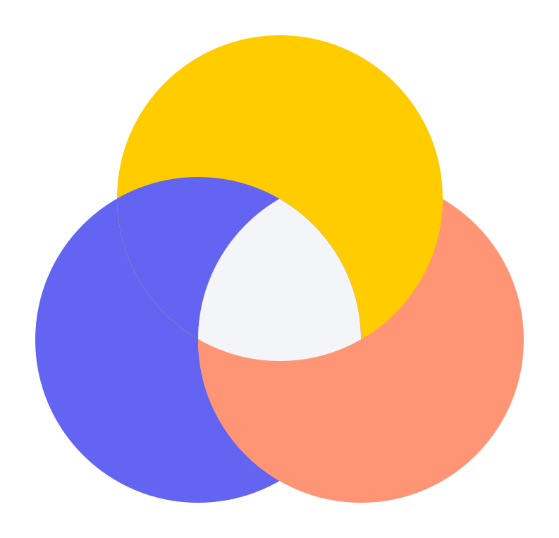

<div align="center">


# compar:IA

### The open-source LLM arena. Deploy it for your organisation, sector, or language.

Crowdsource human votes, benchmark models, and build open datasets in any language/sector.

<br>

[](./LICENSE)
[](https://huggingface.co/ministere-culture)
[](https://arxiv.org/abs/2602.06669)
[](https://www.digitalpublicgoods.net/r/comparia)

**[Try the arena](https://comparia.beta.gouv.fr)** · **[Datasets](https://huggingface.co/ministere-culture)** · **[Deploy your own](#deploy-your-own)** · **[Roadmap](#roadmap)** · **[Contribute](#contribute)**

</div>

---

## What is compar:IA?

compar:IA is an LLM arena: the user types a prompt, two anonymous models reply, and the user votes for the answer they prefer. Only after voting (or skipping the vote) does the user see which models wrote the answers.


<div align="center">
  
</div>


The platform can be used for many different purposes:

- Teaching people about model diversity, bias, openness, energy consumption...
- Ranking models on real-world use instead of "laboratory" benchmarks, so you can see which ones work best in your own use case and language.
- Building and publishing open datasets of prompts, votes, and reactions that anyone can reuse to study how people use these tools, or to train and fine-tune models.

## The story of compar:IA

- **Oct 2024:** The French government launches [comparia.beta.gouv.fr](https://comparia.beta.gouv.fr), an LLM arena open to the public.
- **Mar 2025:** 50,000 votes reached, and the first dataset goes up on Hugging Face.
- **Nov 2025:** The first public leaderboard ships, and a second instance goes live: [AI-arenaen](https://ai-arenaen.dk) in Denmark.
- **Jun 2026:** Over 700,000 conversations and 250,000 votes ([about 89% in French](https://arxiv.org/abs/2602.06669)), several datasets, and new instances starting up regularly.
- **Sept 2026:** compar:IA 2.0 is released : message history, personal leaderboard, admin panel, etc. compar:IA is now built to be run by anyone: a company, a sector, or a language community.

## Active instances

| Instance | Region | Live | Datasets |
| --- | :---: | --- | --- |
| **compar:IA**, French Government | 🇫🇷 | [comparia.beta.gouv.fr](https://comparia.beta.gouv.fr) | [Hugging Face](https://huggingface.co/datasets/ministere-culture/comparia-fr-arena), [data.gouv.fr](https://www.data.gouv.fr/datasets/compar-ia), [Mozilla](https://mozilladatacollective.com/datasets/cmklbq9qt006mnw077t9lqh89) |
| **AI-arenaen**, Denmark | 🇩🇰 | [ai-arenaen.dk](https://ai-arenaen.dk) | *coming soon* |
| **Yours?** | 🌍 | [Deploy one](#deploy-your-own) | your own |

## Deploy your own

Run the whole platform yourself — your own models, your own language, your own datasets and leaderboard.

**Self-host with Docker** (single server, automatic HTTPS via Caddy): see [devops/standalone_docker_install/DOCKER_INSTALL.md](https://github.com/betagouv/ComparIA/blob/develop/devops/standalone_docker_install/DOCKER_INSTALL.md).

**Local development:**

```bash
cp .env.example .env   # configure your environment variables
make install           # install all dependencies
source .env

make dev-backend       # backend  -> http://localhost:8008
make dev-frontend      # frontend -> http://localhost:5173
```

For the full setup guide (instances, KeePass, Docker, testing, models, i18n, architecture), see [CONTRIBUTING.md](https://github.com/betagouv/ComparIA/blob/develop/CONTRIBUTING.md).

## Roadmap

**In progress**
- Agentic tool use
- OIDC SSO
- Improved style control

<details>
<summary><b>Done</b></summary>

<br>
- [Authentication](https://github.com/betagouv/ComparIA/milestone/11) *(🇪🇺 ALT-EDIC, 🇫🇷 DINUM)*
- Style control, [#532](https://github.com/betagouv/ComparIA/pull/532) *(🇫🇷 Ministry of Culture)*
- Prompt moderation, [#542](https://github.com/betagouv/ComparIA/pull/542) *(🇫🇷 Ministry of Culture)*
- [Improved model cards](https://github.com/betagouv/ComparIA/milestone/14) *(🇫🇷 Ministry of Culture)*
- Live use-case mapping *(🇪🇺 ALT-EDIC, 🇫🇷 DINUM)*
- Message history *(🇪🇺 ALT-EDIC, 🇫🇷 DINUM)*
- Socio-demographic data collection *(🇪🇺 ALT-EDIC, 🇫🇷 DINUM)*
- [Back-office management](https://github.com/betagouv/ComparIA/milestone/17) *(🇪🇺 ALT-EDIC, 🇫🇷 DINUM)*
- New voting system *(🇪🇺 ALT-EDIC, 🇫🇷 Ministry of Culture)*
- Web search *(🇪🇺 ALT-EDIC)*
- Separation of all platforms into separate instances *(🇪🇺 ALT-EDIC, 🇫🇷 DINUM)*
- Ranking consolidation and internationalization *(🇪🇺 ALT-EDIC, 🇫🇷 DINUM)*
- Language / platform-specific model support *(🇪🇺 ALT-EDIC, 🇫🇷 DINUM)*
- Gradio to FastAPI migration *(🇫🇷 Ministry of Culture, 🇫🇷 DINUM, 🇪🇺 ALT-EDIC)*
- [EcoLogits update](https://github.com/betagouv/ComparIA/pull/253) *(🇪🇺 ALT-EDIC, 🇫🇷 DINUM)*
- Dataset publishing pipeline v1 *(🇫🇷 DINUM, 🇫🇷 Ministry of Culture)*
- Leaderboard v1 *(🇫🇷 DINUM, 🇫🇷 Ministry of Culture, with 🇫🇷 PEReN)*
- Archived models *(🇫🇷 DINUM, 🇫🇷 Ministry of Culture)*
- Blog section *(🇫🇷 DINUM, 🇫🇷 Ministry of Culture)*
- Internationalization foundations *(🇫🇷 DINUM, 🇫🇷 Ministry of Culture)*
- compar:IA v1 *(🇫🇷 DINUM, 🇫🇷 Ministry of Culture)*

</details>

## Contribute

compar:IA is a digital common. You can help financially, in code, translations, or ideas.

- **Run your own instance.** compar:IA achieves its mission as instances multiply — and with them, open datasets, benchmarks, and people who understand these tools.
- **Financially.** compar:IA is funded by ALT-EDIC, DINUM and the French Ministry of Culture. We are looking for new partners and funders to keep the infrastructure running, add languages, and keep the project independent. Reach us at [contact@comparia.beta.gouv.fr](mailto:contact@comparia.beta.gouv.fr).
- **In code.** The whole platform is open source and we welcome contributions of any size: bug fixes, features, translations, documentation. [Open a pull request](https://github.com/betagouv/ComparIA/pulls).
- **In discussions.** Share ideas, flag issues, or ask questions on [GitHub Discussions](https://github.com/betagouv/ComparIA/discussions).
- **Any other way.** Partnerships, academic work, media coverage, or spreading the word. [Get in touch](mailto:contact@comparia.beta.gouv.fr).

## Built by

**DINUM**, **French Ministry of Culture**, and **ALT-EDIC** 🇪🇺, with **AI-arenaen** (Denmark), **PIX**, **PEReN**, and other contributors.

---

<div align="center">

Read the paper: **[compar:IA: The French Government's LLM arena](https://arxiv.org/abs/2602.06669)**

</div>
