<h1 align="center">Open Source LLM Arena</h1>

<p align="center">
  <strong>Collect human preference datasets for less-resourced languages and specific sectors,<br>
  while raising awareness about model diversity, bias, and environmental impact.</strong><br><br>
  <em>Built by the French government, now growing into new languages and sectors.</em>
</p>

<p align="center">
  <a href="https://comparia.beta.gouv.fr/">🇫🇷 French platform</a>&nbsp;&nbsp;·&nbsp;&nbsp;
  <a href="https://ai-arenaen.dk/">🇩🇰 Danish platform</a>
</p>

<p align="center">
  
</p>

---

## How does it work?

<div align="center">
  <a href="https://comparia.beta.gouv.fr/"
     aria-label="Click to visit the hosted platform"
     title="Demo video of the comparator">
    <video
      src="https://github.com/user-attachments/assets/06ce8c3d-aec1-48d6-ab64-a75a08020796"
      width="800"
      autoplay
      loop
      muted
      playsinline
    />

```mermaid
flowchart LR
    U["👤 Ask"] --> A["🤖 Compare"] --> V["🗳️ Vote"] --> R["🔍 Reveal"]

    R --> L["🏆 Leaderboard"]
    R --> T["🧠 Rare data for model training"]
    R --> M["🗺️ Use case mapping"]
    R --> E1["💡 Model diversity"]
    R --> E2["⚖️ Bias awareness"]
    R --> E3["🌱 Env. impact"]

    style U fill:#f0f4ff,stroke:#3558a2
    style A fill:#f0f4ff,stroke:#3558a2
    style V fill:#f0f4ff,stroke:#3558a2
    style R fill:#f0f4ff,stroke:#3558a2
    style E1 fill:#e8f5e9,stroke:#388e3c
    style E2 fill:#e8f5e9,stroke:#388e3c
    style E3 fill:#e8f5e9,stroke:#388e3c
    style L fill:#fff3e0,stroke:#e65100
    style T fill:#fff3e0,stroke:#e65100
    style M fill:#fff3e0,stroke:#e65100
```

  </a>
</div>



<p align="center">
  <em>🟦 User journey &nbsp;&nbsp; 🟩 Awareness value &nbsp;&nbsp; 🟧 Dataset value</em>
</p>

---

## 🇫🇷 The French use case

<table>
<tr>
<td width="55%" valign="top">

Launched in October 2024 by [DINUM](https://www.numerique.gouv.fr/dinum/) and the French [Ministry of Culture](https://www.culture.gouv.fr/) to address the lack of French-language preference data for LLM training nd evaluation.

Since launch: **600,000+ prompts**, **250,000+ preference votes**, 300,000+ visitors. One of the largest non-English human preference datasets available. All data published openly on Hugging Face:

- [comparia-conversations](https://huggingface.co/datasets/ministere-culture/comparia-conversations) (460k+ entries)
- [comparia-votes](https://huggingface.co/datasets/ministere-culture/comparia-votes) (149k+ entries)
- [comparia-reactions](https://huggingface.co/datasets/ministere-culture/comparia-reactions) (89k+ entries)

We published a [pre-print](https://huggingface.co/papers/2602.06669) to dive deep into the project's strategy in France.

</td>
<td width="45%" valign="top">


<sub><em>Compar:IA on the France 2 evening news, used in the classroom to teach students about AI models, bias, and environmental impact.</em></sub>

</td>
</tr>
</table>

---

## For whom?

<table>
<tr>
<td width="33%" valign="top">

### 🌍 Languages

Most LLMs underperform outside English. Compar:IA collects the preference data needed to close this gap.

Already live in **French and Danish**, and planning launches in Sweden, Estonia and Lithuania.

</td>
<td width="33%" valign="top">

### 🏛️ Sectors

Generic benchmarks miss domain-specific needs. A sector arena reveals which models handle specialised language best.

*Healthcare, legal, education, public admin, agriculture...*

</td>
<td width="33%" valign="top">

### 🏢 Organisations

Run your own arena, evaluate models on your real-world tasks, and contribute data back to the commons.

*Governments, universities, hospitals, companies, NGOs...*

</td>
</tr>
</table>

---

## Benefits

<table>
<tr>
<td width="33%" align="center">

### 💡 Raise awareness

Teach citizens and professionals about model diversity, bias, and environmental cost. Already used in schools and training sessions.


</td>
<td width="33%" align="center">

### 📊 Generate rare datasets

Produce instruction and preference data in less-ressourced languages. 


</td>
<td width="33%" align="center">

### 🔁 Downstream reuse

Data feeds into new model training, leaderboards, use case mappings, and other research topics.


</td>
</tr>
</table>

---

## Interested in an arena for your language, sector, or organisation?

The platform is fully open source, self-hostable, and customizable: choose your models, translate the interface, adapt prompt suggestions, add your logo. We can host it for you or help you set it up yourself.

Whatever your situation, **reach out first** and we'll figure out the best path together.

📬 **[contact@comparia.beta.gouv.fr](mailto:contact@comparia.beta.gouv.fr)**

---

## Contribute, we need you 🤝

Compar:IA is a digital common. Whether you can offer funding, code, translations, or simply ideas, there is a place for you.

**💰 Financially.** Compar:IA has been funded by DINUM and the French Ministry of Culture, with European support from ALT-EDIC. We are actively looking for new partners and funders to sustain the infrastructure, expand to new languages, and keep the project independent. **[contact@comparia.beta.gouv.fr](mailto:contact@comparia.beta.gouv.fr)**

**💻 In code.** The entire platform is open source and we welcome contributions of all sizes: bug fixes, new features, translations, documentation. Come build with us. **[GitHub repository](https://github.com/betagouv/ComparIA)**

**💬 In discussions.** Share your ideas, flag issues, or just ask questions on GitHub Discussions. We want to hear from you. **[GitHub Discussions](https://github.com/betagouv/ComparIA/discussions)**

**Any other way.** Partnerships, academic collaborations, media coverage, spreading the word: every contribution matters. Reach out and let's talk. **[Contact us](mailto:contact@comparia.beta.gouv.fr)**

---

## Roadmap

### 🟢 In Progress
- **EcoLogits update** [#253](https://github.com/betagouv/ComparIA/pull/253) *(🇪🇺 ALT-EDIC, 🇫🇷 DINUM)*
- **Gradio → FastAPI migration** *(🇫🇷 Ministry of Culture, 🇫🇷 DINUM, 🇪🇺 ALT-EDIC)*
- **Language/platform-specific model support** *(🇪🇺 ALT-EDIC, 🇫🇷 DINUM)*
- **Dataset publication pipeline** configurable per language/platform, with customizable publication delays and anonymization pipelines *(🇪🇺 ALT-EDIC, 🇫🇷 DINUM)*

### 🔮 Up Next
- Web search and document upload
- Authentication
- Style control [#273](https://github.com/betagouv/ComparIA/pull/273)
- Ranking consolidation and internationalization
- Message history
- Easier deployment and streamlined onboarding
- Improved anonymization pipeline
- Live use-case mapping

### ⛵ Shipped
- Dataset publishing pipeline v1 *(🇫🇷 DINUM, 🇫🇷 Ministry of Culture)*
- Leaderboard v1 *(🇫🇷 DINUM, 🇫🇷 Ministry of Culture, in collaboration with 🇫🇷 PEReN)*
- Archived models *(🇫🇷 DINUM, 🇫🇷 Ministry of Culture)*
- Blog section *(🇫🇷 DINUM, 🇫🇷 Ministry of Culture)*
- Internationalization foundations *(🇫🇷 DINUM, 🇫🇷 Ministry of Culture)*
- compar:IA v1 *(🇫🇷 DINUM, 🇫🇷 Ministry of Culture)*

---

👉 **[Full technical roadmap on GitHub](https://github.com/orgs/betagouv/projects/160)**

---

## Getting started

The platform is fully open source and self-hostable. The quickest way to get running:

```bash
cp .env.example .env       # Configure environment
make install               # Install all dependencies
make dev                   # Start backend + frontend
```

For the full setup guide (Docker, manual setup, testing, database, models, i18n, architecture), see **[CONTRIBUTING.md](CONTRIBUTING.md)**.

<a href="https://digitalpublicgoods.net/r/comparia" target="_blank" rel="noopener noreferrer"></a>
